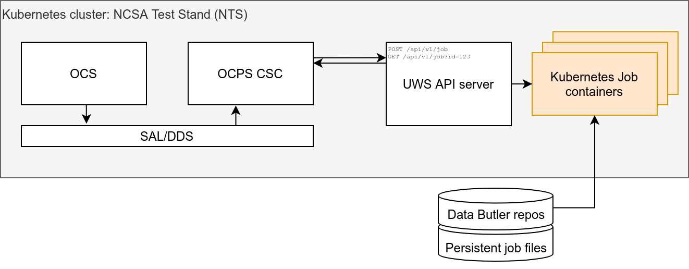

Rubin OCS Controlled Pipeline System (OCPS) prototype
========================================================

Prototype
------------------------------------------------------------------------

The prototype OCPS Job Manager is designed as an evolving demonstration of the emerging system.

The prototype consists of a server and a client.

* The server is a `Tornado-based webserver <https://www.tornadoweb.org/en/stable/>`_ written in Python.
* The client represents the OCPS CSC that will ultimately be submitting jobs and fetching the results. The client is a Python script that could in principle be executed on any machine that can access the OCPS Job Manager HTTP port.

Currently the prototype can be deployed on the NCSA Test Stand (NTS) and NCSA Integration (INT) Kubernetes clusters.

Server - OCPS Job Manager
--------------------------------

The OCPS Job Manager is the ``server/server.py`` module, which implements a Universal Worker Service (UWS) API server to provide an asynchronous job management system that follows the `Universal Worker Service Pattern defined by the International Virtual Observatory Alliance <https://www.ivoa.net/documents/UWS/>`_.

Job Manager API Specification
^^^^^^^^^^^^^^^^^^^^^^^^^^^^^

.. note::
  For the definition of the API spec, see :doc:`api/Readme`. **This may not reflect the current prototype.**

Client - OCSP CSC
----------------------

As currently envisioned, the data (e.g. camera images) that form the input to the prompt processing jobs will be transferred from the OCS by an independent system; thus the input data is assumed to be accessible to the UWS as a Butler repo residing on some locally mounted storage.

The prototype client (the ``client/client.py`` module) provides some wrapper functions around the API server endpoints, as well as a demo of some HTTP requests that create and manage jobs.

Jobs
----------------------

Jobs run as Kubernetes Jobs. The container image for each job is the ``ghcr.io/lsst/scipipe:d_latest`` Docker image.

There are environment variables set for all jobs for use by executing scripts:

- ``$JOB_ID`` - provides the job script with the UUID associated with the job.
- ``$JOB_OUTPUT_DIR`` - provides the job script with the path to the output directory where the job results are expected to be stored.
- ``$DATA_DIR*`` - (NTS cluster only) provide the job script with the path to the locations of the available mounted data Butler repos. For example, on the NTS there is ``$DATA_DIR_COMCAM`` for ComCam data and ``$DATA_DIR_AUXTEL`` for AuxTel data.
- ``$PROJECT_PATH`` - (INT cluster only) This points to the subdirectory of `/project` mounted in the job container
- ``$JOB_SOURCE_DIR`` - (optional) provides the job script with the path to the location of the cloned git repo.
- ``$SRC_GIT_URL`` - (optional) provides the job script with the git repo URL.
- ``$GIT_COMMIT_REF`` - (optional) provides the job script with the git reference specifying the git repo state.

.. note::
  See the :doc:`client_demo` for an example of how to create and manage a job.

Create a job::

  PUT /api/v1/job

  Parameters:

    command - command to execute
    run_id - custom identifier for client use only
    environment - array of objects with name and value specifying the environment variables for the executing script
    url - git repo URL to clone for use by job script
    commit_ref - git reference (branch name, commit, tag) denoting the desired git clone state

Get info about a specific job with ID ``{jobId}``::

  GET /api/v1/job/{jobId}

  Response:

  {
      "jobId": "e13ed9f2803842409763b185d4f490e2",
      "runId": "my-special-job",
      "ownerId": "",
      "phase": "executing",
      "creationTime": "2021-03-17 20:58:54+00:00",
      "startTime": "2021-03-17 20:58:54+00:00",
      "endTime": null,
      "executionDuration": null,
      "destruction": null,
      "parameters": {
        "command": [
          "/bin/bash",
          "-c",
          "cd /uws/jobs/e13ed9f2803842409763b185d4f490e2/src && ls -l > $JOB_OUTPUT_DIR/dirlist.txt"
        ],
        "environment": [
          {
            "name": "DATA_DIR_COMCAM",
            "value": "/data/lsstdata/comcam/oods/butler/repo"
          },
          {
            "name": "DATA_DIR_AUXTEL",
            "value": "/data/lsstdata/auxTel/oods/butler/repo"
          },
          {
            "name": "JOB_SOURCE_DIR",
            "value": "/uws/jobs/e13ed9f2803842409763b185d4f490e2/src"
          },
          {
            "name": "SRC_GIT_URL",
            "value": "https://github.com/lsst-dm/uws-api-server"
          },
          {
            "name": "GIT_COMMIT_REF",
            "value": null
          },
          {
            "name": "JOB_OUTPUT_DIR",
            "value": "/uws/jobs/e13ed9f2803842409763b185d4f490e2/out"
          }
        ]
      },
      "results": [],
      "errorSummary": {
        "message": ""
      },
      "jobInfo": {}
    }

List jobs that are executing::

  GET /api/v1/job?phase=executing

  Response:

  [
    {
      "jobId": "e13ed9f2803842409763b185d4f490e2",
      "runId": "my-special-job",
      "ownerId": "",
      "phase": "executing",
      "creationTime": "2021-03-17 20:58:54+00:00",
      "startTime": "2021-03-17 20:58:54+00:00",
      ...
      additional details omitted for brevity
      ...
    },
    {
      "jobId": "a6b9043ef0c24170b019641da57a0dba",
      "runId": "my-other-job",
      "ownerId": "",
      "phase": "executing",
      "creationTime": "2021-03-17 15:58:54+00:00",
      "startTime": "2021-03-17 16:58:54+00:00",
      ...
      additional details omitted for brevity
      ...
    }
  ]

Get the phase of job with ID ``{jobId}``::

  GET /api/v1/job/{jobId}/phase

  Response:

  "completed"

Job results are defined as the files generated during execution in the job output folder, whose path is available to the job script via an environment variable ``$JOB_OUTPUT_DIR``. The UWS job object spec recommends an ID and a URI. Our URI is the path to the result file and the ID is the base64-encoded version of that path string, which is amenable to URLs and has the benefit of encoding the files universally unique path on disk (since the job UUID is part of the file path).

Get the results of job with ID ``{jobId}``::

  GET /api/v1/job/{jobId}/results

  Response:

  [
    {
      "id": "L3V3cy9qb2JzL2UxM2VkOWYyODAzODQyNDA5NzYzYjE4NWQ0ZjQ5MGUyL291dC9kaXJsaXN0LnR4dA==",
      "uri": "/uws/jobs/{jobId}/out/dirlist.txt"
    }
  ]

Download a job result file from job with result ID ``{resultId}``::

  GET /api/v1/job/result/{resultId}

  Response:

  (requested file)
